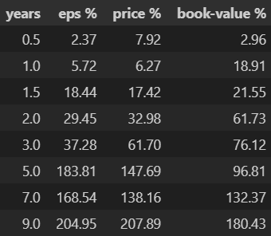
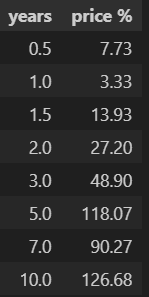
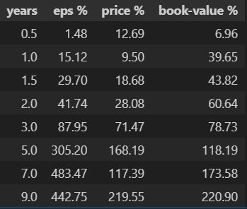
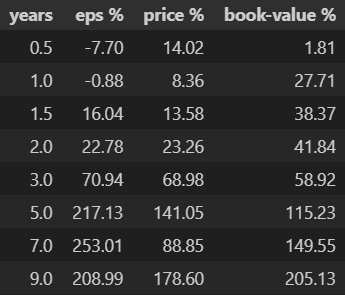
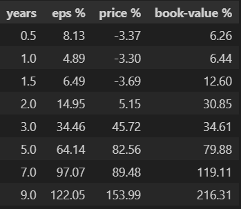
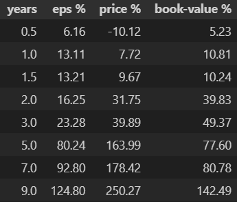
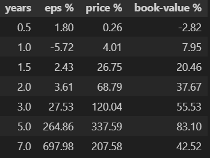

# niffy

## Helps to organise, sort and analyse past earnings, networth and returns

There are two steps to calculate.

- <strong>cleaning phase:</strong> download the raw past prices and valuation data from NSE website and paste those in respective files in the cleaning folder. Now execute the python script and a <strong>"data.csv" in the analysis folder</strong> will be generated where all the sorted data will be stored.

- <strong>analysis phase:</strong> Now if you want to add past data then add from the data folder or else execute the python script and analysis will be generated. The time frame can also be modified in months to generate different timeframe results.

---

## Not only nifty it can calculate all index data

<label>Nifty 50 and Nifty USD </label> 

<label>Nifty Bank & PVT Bank</label> 

<label>Nifty FMCG and IT</label> 

<label>Nifty Smallcap 250</label> 

### updated upto 30th June-2025

gayandip layek
 
Thanks
